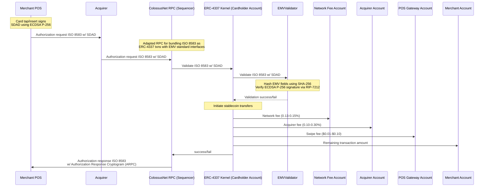
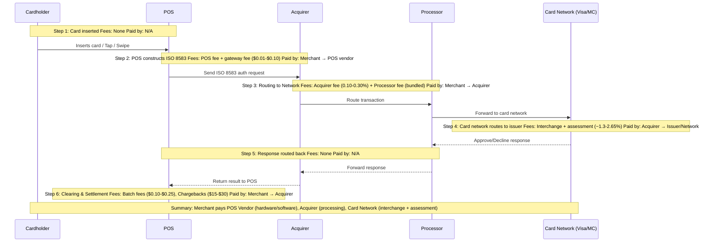

# Colossus Overview

Colossus is a stablecoin credit card network. It works with existing cards and terminals and settles noncustodially on Ethereum.

Colossus turns credit cards into a [private key](https://medium.com/mycrypto/the-magic-of-digital-signatures-on-ethereum-98fe184dc9c7) and the network into an [Ethereum L2](https://www.coinbase.com/learn/crypto-basics/what-are-ethereum-layer-2-blockchains-and-how-do-they-work).

## How does it work?

In short, we have repurposed the standard [EMV (Europay, Mastercard, Visa)](https://www.emvco.com/what-are-emv-specifications/) credit card terminal into signing an Ethereum [ERC-4337](https://eips.ethereum.org/EIPS/eip-4337) transaction.

The cardholder taps their card or phone at the terminal, signing an ERC-4337 transaction. That signature is sent from the terminal to a [credit card acquirer](https://en.wikipedia.org/wiki/Acquiring_bank). The acquirer submits the signature to the ColossusNet sequencer, which executes the transaction and returns a preconfirmation in 100ms.

The preconfirmation is the authorization, sent from the acquirer back to the card terminal.

## Acquirers are the key

Credit card acquirers are the interface between the [card network](https://en.wikipedia.org/wiki/Card_association), merchant, and [issuing bank](https://en.wikipedia.org/wiki/Issuing_bank). Acquirers own the relationship with the merchant, so a Colossus integration with an acquirer makes the card available at all their merchants.

An acquirer's purpose is to settle and authorize transactions. Acquirers authorize the transaction by validating the card signature with the credit card network (Visa, Mastercard, American Express, etc.).

Once authorized, the acquirer queries the issuing bank for funding. If funding is available, the acquirer initiates a transfer from the issuing bank (the cardholder's bank) to the acquiring bank.

Acquirers bear the risk in the transaction for [chargebacks](https://en.wikipedia.org/wiki/Chargeback) and fraud, and pass the chargebacks onto the merchant.

When the funds have landed in the acquiring bank account, the acquirer distributes the funds to each merchant.

The acquirer makes 0.13-0.15% for the services.

## Why is Colossus better?

Colossus is a closed-loop stablecoin credit card network built as an Ethereum L2. Colossus vertically integrates the issuing bank, processor, and card network, saving ~1.28-2.65% in credit card fees, representing a **92-96% fee reduction**.

A Colossus credit card transaction moves stablecoins from the cardholder to the merchant instantly and immutably.

**Acquirers own the merchant distribution, not Visa.** Colossus achieves the same distribution as Visa by integrating directly with acquirers (Fiserv, Elavon, Global Payments, Worldpay, etc.).

Colossus' integration is EMV standards compliant, meaning integration with acquirers and merchants is familiar and intuitive.

The [GENIUS Act](https://en.wikipedia.org/wiki/GENIUS_Act) grants Colossus the ability to move stablecoins without [KYC/AML](https://en.wikipedia.org/wiki/Know_your_customer) or a [money transmitter license](https://en.wikipedia.org/wiki/Money_transmitter).

## Fee structure

In the direct debit model (no issuer), the merchant pays only:

| Fee | Rate | Recipient |
|-----|------|-----------|
| Network fee | 0.13-0.15% | ColossusNet |
| Acquirer fee | Up to 0.30% | Acquirer |
| Swipe fee | $0.01-$0.10 per txn | Acquirer |
| **Total** | **~0.23-0.45%** | |

In the [issuer-mediated model](/guides/issuers), an interchange fee of up to 2.50% is added (paid to the issuer who posts collateral). See [Settlement](/technical/settlement) for details.

## Two settlement paths

1. **Direct debit**: The cardholder holds stablecoins on ColossusNet. Transactions debit directly from their balance. No issuer involved.
2. **Issuer-mediated**: An issuer posts collateral and funds transactions on behalf of cardholders. The merchant is settled instantly from the issuer's collateral pool. See the [issuer guide](/guides/issuers) for details.

## Network identifiers

| Parameter | Value |
|-----------|-------|
| RID | `A000000951` |
| Chain ID | `951` |
| Block time | 1 second |
| Preconfirmation | Flashblock (100ms) |

See [Terminal Configuration](/technical/deployment#network-parameters) for the full network parameter reference.
