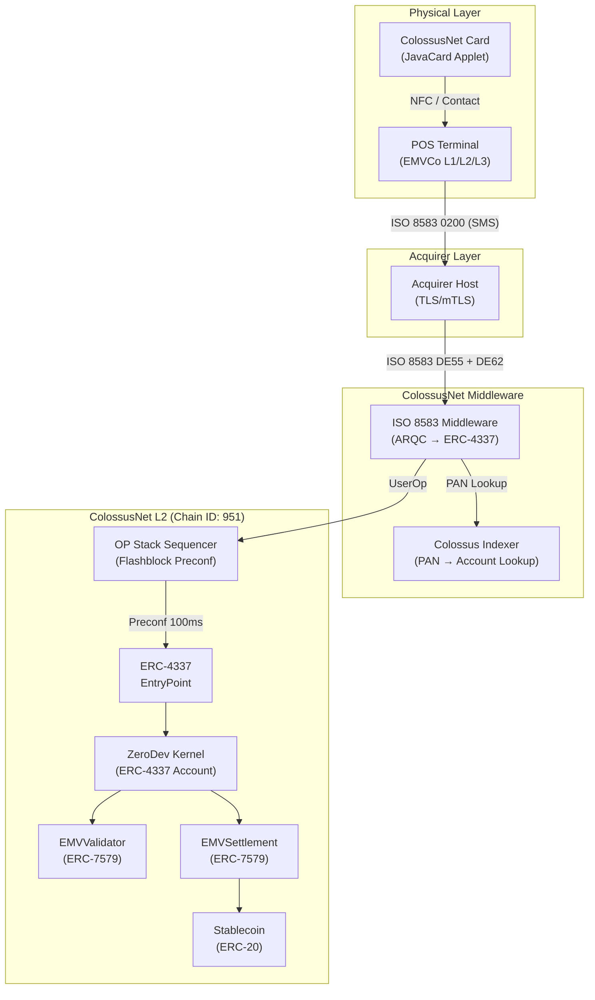
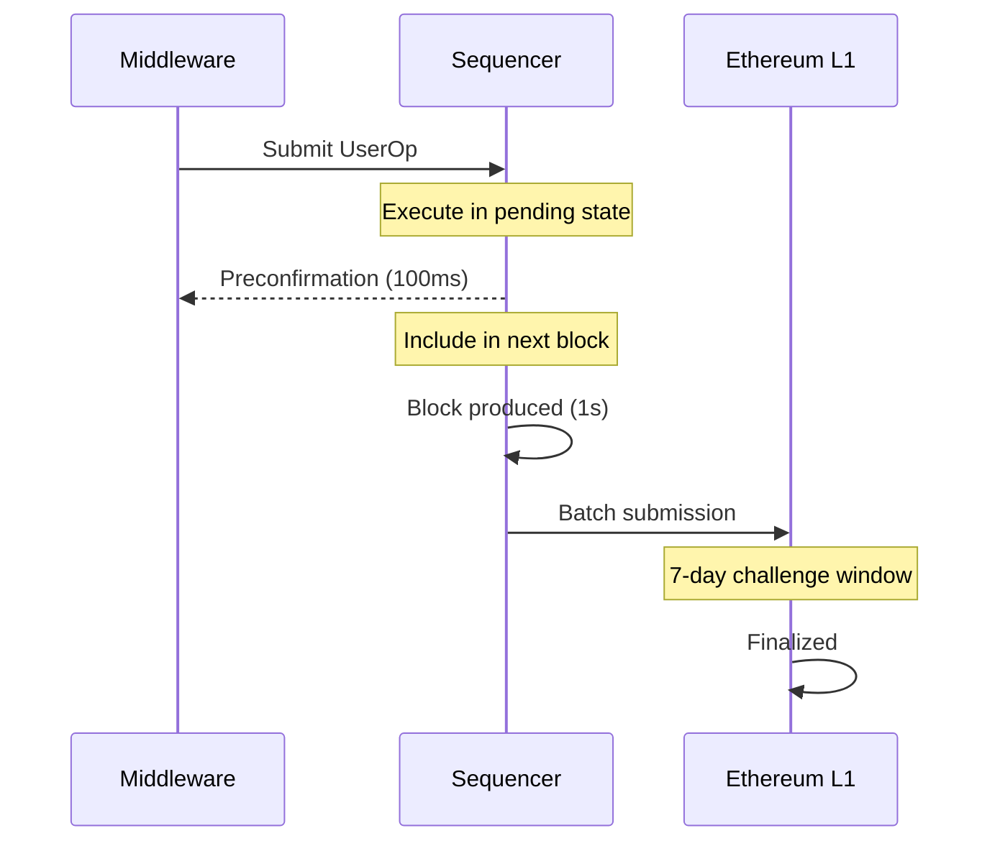
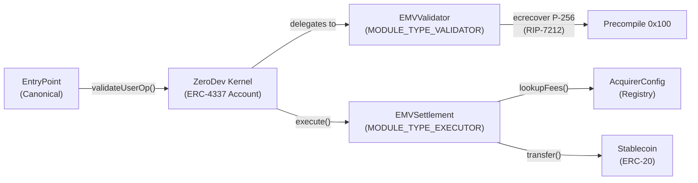

# System Architecture

ColossusNet is a four-layer payment stack that transforms EMV chip card transactions into on-chain settlements on an Ethereum L2 rollup. Each layer is designed so that no single component requires trust beyond what the EMV secure element and Ethereum consensus already provide.

## Architecture layers



### Physical layer

The card and terminal form the trust anchor. The ColossusNet JavaCard applet runs on an EMV-compliant smart card (JavaCard 3.0.5+) and holds an ECDSA P-256 private key in its secure element. The POS terminal is an EMVCo Level 1/2/3 certified device that drives the standard EMV transaction flow (SELECT, GPO, READ RECORD, GENERATE AC). Communication uses ISO 7816 (contact) or ISO 14443 (contactless/NFC).

### Acquirer layer

The acquirer host receives ISO 8583 authorization messages from the terminal over TLS or mTLS. In the traditional card network, the acquirer would route the message to the card network and issuing bank. In ColossusNet, the acquirer forwards the message to the ColossusNet middleware instead.

### ColossusNet middleware

A stateless translation service sitting at the acquirer boundary. It receives binary ISO 8583 messages (MTI 0200), extracts the EMV data (DE55) and ECDSA signature (tag `9F4B`), looks up the cardholder's ERC-4337 account via the Colossus Indexer (PAN-to-account mapping), constructs a UserOperation, and submits it to the sequencer. On receiving a preconfirmation, it returns an ISO 8583 response (MTI 0210) back to the acquirer. See [ISO 8583 Middleware](/technical/middleware) for full details.

### ColossusNet L2

The on-chain settlement layer. An OP Stack rollup with 1-second block times and Flashblock 100ms preconfirmation. The ERC-4337 EntryPoint routes UserOperations to ZeroDev Kernel smart accounts, which delegate signature validation to the EMVValidator module and settlement execution to the EMVSettlement module.

## Message flow

| Step | Protocol | Direction | Message |
|------|----------|-----------|---------|
| 1 | ISO 14443 / ISO 7816 | Card → Terminal | EMV transaction (SELECT → GPO → READ RECORD → GENERATE AC) |
| 2 | ISO 8583 | Terminal → Acquirer | MTI 0200 (Financial Request, SMS) |
| 3 | ISO 8583 | Acquirer → Middleware | MTI 0200 with DE55 (ICC data) + DE62 (signature) |
| 4 | ERC-4337 | Middleware → Sequencer | UserOperation (callData + ECDSA signature) |
| 5 | EVM | Sequencer → Contracts | `validateUserOp()` + `execute()` |
| 6 | ERC-4337 | Contracts → Middleware | Transaction receipt |
| 7 | ISO 8583 | Middleware → Acquirer | MTI 0210 (Financial Response) |
| 8 | ISO 8583 | Acquirer → Terminal | MTI 0210 with DE39 (Response Code) |

## L2 parameters

| Parameter | Value |
|-----------|-------|
| Chain ID | `951` |
| Consensus | OP Stack (Optimistic Rollup) |
| Block time | 1 second |
| Preconfirmation | Flashblock (100ms soft confirmation) |
| Sequencer | Single sequencer (standard OP Stack) |
| Data availability | Ethereum L1 (calldata/blobs) |
| Settlement | Ethereum L1 (optimistic, 7-day challenge window) |

### Flashblock preconfirmation

Flashblocks provide sub-second preconfirmation by allowing the sequencer to issue soft commitments on transactions before they are included in a finalized block.



The middleware submits the UserOperation to the sequencer, which executes it speculatively and returns a preconfirmation within 100ms. The transaction is then included in the next 1-second block and batched to Ethereum L1 for final settlement with a 7-day optimistic challenge window.

## ERC-4337 account abstraction

Each ColossusNet cardholder has an ERC-4337 smart account deployed on the L2. The account implementation uses the **ZeroDev Kernel**, a modular smart account framework that supports the ERC-7579 module standard.

The Kernel receives UserOperations from the canonical ERC-4337 EntryPoint. During `validateUserOp()`, the Kernel delegates to the installed validator module (EMVValidator). During `execute()`, the Kernel delegates to the installed executor module (EMVSettlement).



## ERC-7579 modules

ColossusNet uses two ERC-7579 modules installed on each cardholder's Kernel account:

### EMVValidator (`MODULE_TYPE_VALIDATOR`)

Validates ECDSA P-256 signatures produced by ColossusNet cards. Per-account storage holds the card's 65-byte uncompressed P-256 public key and a mapping of used unpredictable numbers for replay protection. See [Smart Contracts](/technical/smart-contracts#emvvalidator-contract) for the full validation flow.

### EMVSettlement (`MODULE_TYPE_EXECUTOR`)

Executes token transfers with fee distribution after validation succeeds. See [Smart Contracts](/technical/smart-contracts#emvsettlement-contract) for the full execution flow.

## RIP-7212 P-256 precompile

The RIP-7212 precompile at address `0x100` provides native ECDSA P-256 signature verification on the EVM. EMV cards use P-256 (secp256r1) rather than secp256k1 (the Ethereum-native curve), so this precompile is essential.

```solidity
// RIP-7212 P-256 precompile call
// Input: 32-byte hash, 32-byte r, 32-byte s, 64-byte public key (x, y)
(bool success, bytes memory result) = address(0x100).staticcall(
    abi.encodePacked(hash, r, s, pubKeyX, pubKeyY)
);
```

Without this precompile, P-256 verification would require expensive Solidity-level elliptic curve math (~200k+ gas). The precompile reduces this to a fixed low-cost operation.

## Timing budget

Per EMV Book A Section 5.8 and EMV Book 4 Section 6.3.5, the terminal expects an online authorization response within the configured timeout period (typically 1000-3000ms). ColossusNet targets significantly better latency:

| Segment | Measured | Maximum |
|---------|---------|---------|
| Card ↔ Terminal | 15ms | 30ms |
| Terminal → Acquirer (TLS) | 5ms | 15ms |
| Acquirer → Middleware | 5ms | 15ms |
| Middleware processing | 12ms | 25ms |
| Sequencer preconfirmation | 100ms | 150ms |
| Response path (return) | 35ms | 65ms |
| **Total end-to-end** | **172ms** | **300ms** |

ColossusNet achieves **172ms** measured end-to-end authorization latency, well within EMV timing requirements.

## Source code

| Component | Repository |
|-----------|-----------|
| L2 rollup sidecar | [rollup-boost](https://github.com/colossus-credit/rollup-boost) |
| Block building environment | [builder-playground](https://github.com/colossus-credit/builder-playground) |
| Local development network | [devnet](https://github.com/colossus-credit/devnet) |
| ERC-4337 smart account | [kernel](https://github.com/colossus-credit/kernel) |
