# Cross-Chain Architecture

ColossusNet enables cardholders and issuers to fund accounts from any supported chain without requiring a centralized bridge operator. Cross-chain functionality is built on LayerZero's Omnichain Fungible Token standard.

## LayerZero OFT V2 Bridging

ColossusNet uses **LayerZero OFT V2** (Omnichain Fungible Token) to bridge stablecoins between source chains and the ColossusNet L2. This allows:

- Cardholders to deposit stablecoins from any supported chain into their ColossusNet account.
- Issuers to post collateral from their preferred chain.
- Trustless bridging without a centralized bridge operator.

---

## Supported Stablecoins

See [Smart Contracts](/technical/smart-contracts#supported-stablecoins) for the full list of supported stablecoins. Any supported stablecoin can be bridged from a source chain to ColossusNet.

---

## Source Chain Compatibility

All Layer 1 and Layer 2 chains that support **EVM** (Ethereum Virtual Machine) and **LayerZero OFT V2** are compatible as source chains for ColossusNet. Compatible chains include:

| Chain | Type |
|-------|------|
| Ethereum Mainnet | L1 |
| Arbitrum | L2 |
| Optimism | L2 |
| Base | L2 |
| Polygon | L1 (PoS) |
| Avalanche | L1 |
| Other EVM-compatible chains with LayerZero endpoints | Various |

**SVM** (Solana Virtual Machine) support is in progress.

---

## ERC-7579 Source Chain Modules

Cardholders should install the standard ColossusNet ERC-7579 modules on their ERC-4337 account on the source chain. These modules mirror the ColossusNet L2 modules but operate on the source chain:

| Module | Type | Purpose |
|--------|------|---------|
| **EMVValidator** | `MODULE_TYPE_VALIDATOR` | Validates card-originated signatures on the source chain, enabling issuers to noncustodially retrieve settlement amounts from cardholder wallets. |
| **EMVSettlement** | `MODULE_TYPE_EXECUTOR` | Executes stablecoin transfers on the source chain for issuer settlement, without requiring cardholder interaction. |

These modules enable the issuer to present the card's EMV signature as authorization to debit the cardholder's source chain account for settlement against the issuer's balance sheet.

---

## How Issuer Settlement Works Across Chains

The issuer-mediated model decouples the merchant payment from the cardholder debit, using cross-chain modules to settle asynchronously:

```mermaid
flowchart LR
    subgraph L2["ColossusNet L2 (instant)"]
        A[Card tapped at terminal] --> B[EMV signature validated]
        B --> C[Merchant settled from issuer collateral]
    end
    subgraph SC["Source Chain (deferred)"]
        D[Issuer submits card EMV signature] --> E[EMVValidator verifies P-256 signature]
        E --> F[EMVSettlement transfers stablecoins cardholder → issuer]
    end
    C -.->|Async settlement| D
```

**Step-by-step flow:**

1. A cardholder taps their ColossusNet card at a terminal.
2. The transaction is validated and settled on the ColossusNet L2. The merchant receives payment instantly from the issuer's collateral pool.
3. After settlement, the issuer independently retrieves the settlement amount from the cardholder on the source chain.
4. The cardholder's source chain account has `EMVValidator` and `EMVSettlement` ERC-7579 modules installed.
5. The issuer submits the card's EMV signature (the same signature used for the original transaction) to the source chain `EMVValidator`.
6. The source chain `EMVSettlement` module executes a stablecoin transfer from the cardholder's wallet to the issuer, noncustodially.

This asynchronous settlement model decouples the merchant payment (instant, from collateral) from the cardholder debit (deferred, on source chain), allowing issuers to manage credit risk and settlement timing independently.
