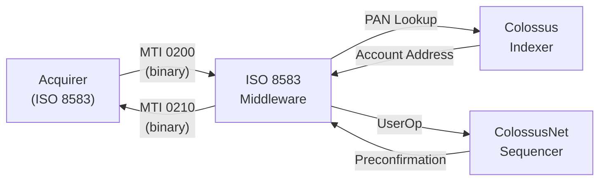

# ISO 8583 Middleware

The ISO 8583 middleware is the bridge between the traditional card payment network and ColossusNet's on-chain settlement layer. It translates binary ISO 8583 authorization requests into ERC-4337 UserOperations and translates on-chain results back into ISO 8583 responses.

## Service architecture

The middleware is a **stateless translation service** running at the acquirer boundary:

1. Receives a binary ISO 8583 message (MTI 0200)
2. Parses DE55 (ICC/EMV data) and DE62 (signature data)
3. Looks up the ERC-4337 account by PAN via the Colossus Indexer
4. Constructs an ERC-4337 UserOperation
5. Submits to the ColossusNet sequencer
6. Receives a preconfirmation
7. Returns a binary ISO 8583 response (MTI 0210)



## API endpoints

| Method | Path | Content-Type | Description |
|--------|------|-------------|-------------|
| `POST` | `/arqc` | `application/octet-stream` | Process ARQC, return ARPC |
| `GET` | `/health` | `application/json` | Service health (DB + contracts) |
| `GET` | `/metrics` | `text/plain` | Prometheus metrics |

## Inbound message (MTI 0200)

The middleware expects the following Data Elements in the ISO 8583 MTI 0200 financial request:

| DE | Name | Required | Description |
|----|------|----------|-------------|
| 2 | PAN | Yes | Primary Account Number |
| 4 | Amount | Yes | Transaction amount |
| 11 | STAN | Yes | Systems Trace Audit Number |
| 14 | Expiration Date | Yes | Card expiry |
| 22 | POS Entry Mode | Yes | `051` (chip) or `071` (contactless) |
| 41 | Terminal ID | Yes | 8-character terminal identifier |
| 42 | Merchant ID | Yes | 15-character merchant identifier |
| 49 | Currency Code | Yes | ISO 4217 numeric |
| 55 | ICC Data | Yes | TLV-encoded EMV tags including 9F4B |

## DE55 tag extraction

The middleware parses the following tags from DE55 (ICC/EMV Data):

| Tag | Field | Used for |
|-----|-------|----------|
| `9F26` | Application Cryptogram | Packed into on-chain data |
| `9F27` | CID | Verify ARQC type (must be `0x80`) |
| `9F37` | Unpredictable Number | Replay protection (uniqueness) |
| `9F02` | Amount | Settlement amount |
| `5F2A` | Currency Code | Token selection |
| `9A` | Transaction Date | Audit |
| `9C` | Transaction Type | Must be `0x00` (purchase) |
| `95` | TVR | Passed through to contract |
| `9F34` | CVM Results | Passed through |
| `9F4B` | SDAD | **ECDSA signature** (extracted for UserOp) |

## UserOperation construction

After parsing the ISO 8583 message, the middleware constructs an ERC-4337 UserOperation:

```
UserOperation {
    sender:           <ERC-4337 account address (from PAN lookup)>,
    nonce:            <EntryPoint nonce for EMVValidator>,
    callData:         kernel.execute(
                        CALLTYPE_DELEGATECALL,
                        encodePacked(
                            emvSettlement,
                            emvSettlement.execute.selector,
                            emvFields[61 bytes]
                        )
                      ),
    signature:        <ECDSA signature from 9F4B (raw r,s)>,
    paymasterAndData: <ColossusNet gas sponsor>
}
```

The `sender` is resolved by querying the Colossus Indexer with the PAN from DE2. The `signature` field contains the raw `(r, s)` values extracted from the DER-encoded ECDSA signature in tag `9F4B`. The `callData` encodes a delegatecall through the ZeroDev Kernel to the EMVSettlement executor module, passing the 61-byte packed EMV fields.

## EMV fields packing (61 bytes)

The EMV fields are packed into a 61-byte binary structure passed as callData to the EMVSettlement contract:

| Offset | Size | Source tag | Field |
|--------|------|-----------|-------|
| 0 | 8 | `9F26` | ARQC (Application Cryptogram) |
| 8 | 4 | `9F37` | Unpredictable Number |
| 12 | 6 | `9F02` | Amount (BCD) |
| 18 | 2 | `5F2A` | Currency Code |
| 20 | 3 | `9A` | Transaction Date (BCD) |
| 23 | 1 | `9C` | Transaction Type |
| 24 | 5 | `95` | TVR |
| 29 | 3 | `9F34` | CVM Results |
| 32 | 8 | `9F1C` | Terminal ID |
| 40 | 15 | `9F16` | Merchant ID |
| 55 | 6 | `9F01` | Acquirer ID |

The EMVValidator contract hashes these 61 bytes with SHA-256 and verifies the ECDSA P-256 signature against the cardholder's registered public key using the RIP-7212 precompile at address `0x100`:

```
H = SHA-256(emvFields[0:61])
valid = ecrecover_P256(H, r, s, publicKey)
```

## Response message (MTI 0210)

After receiving the on-chain result, the middleware constructs an ISO 8583 MTI 0210 financial response:

| DE | Name | Value |
|----|------|-------|
| 39 | Response Code | `00` (Approved) or `05` (Declined) |
| 38 | Authorization ID | Transaction hash (first 6 chars) |
| 55 | ICC Data | ARPC cryptogram (tag 91) |

The response is returned as binary `application/octet-stream` to the acquirer, which forwards it to the terminal. A DE39 value of `00` causes the terminal to display "Approved."

## Gas sponsorship

ColossusNet sponsors all transaction gas. The cardholder does not need ETH or any native token. The `paymasterAndData` field in the UserOperation references the ColossusNet paymaster contract, which covers execution costs. Gas costs are amortized into the network fee structure.
