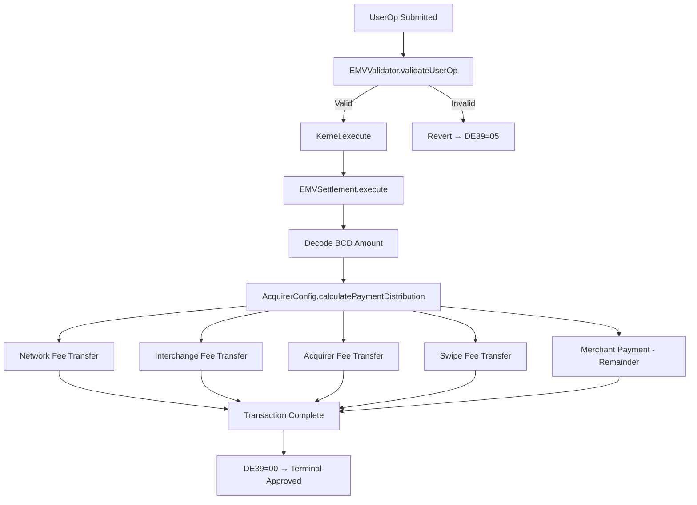

# Settlement & Clearing

ColossusNet eliminates the traditional dual-message authorization/clearing cycle by combining authorization and settlement into a single atomic transaction.

## Single Message System

ColossusNet operates as a **Single Message System (SMS)** where authorization and settlement occur atomically in the same transaction:

1. The ISO 8583 MTI 0200 (Financial Request Message) triggers both authorization validation and token transfer.
2. There is no separate clearing or settlement batch. The ERC-20 transfer executes during authorization.
3. The ARPC (MTI 0210) confirms that settlement has already occurred.

This eliminates the traditional dual-message authorization/clearing cycle and the associated settlement risk window.

---

## Settlement Flow

The settlement flow follows this sequence:



If validation fails at any point, the entire transaction reverts and the terminal receives a decline response code (`DE39=05`). When validation succeeds, all fee transfers and the merchant payment execute atomically, and the terminal receives an approval (`DE39=00`).

---

## Real-Time Settlement Properties

| Property | Value |
|----------|-------|
| Settlement Finality | Immediate (within same transaction) |
| Batch Processing | None (each transaction settles independently) |
| End-of-Day Reconciliation | Not required (on-chain state is authoritative) |
| Chargeback Window | N/A (handled by third-party insurance) |
| Reversal Support | Not supported in v1 (planned for v2 with MTI 0400/0410) |

---

## Cardholder Balance & Credit

ColossusNet supports two settlement paths for cardholder funds:

### Direct Debit Model

The cardholder's ERC-4337 kernel account on ColossusNet holds stablecoin tokens. Transactions debit directly from this balance without issuer involvement.

### Issuer-Mediated Model

The issuer posts collateral to ColossusNet and funds transactions on behalf of the cardholder. The settlement flow works as follows:

1. The merchant is settled instantly from the issuer's collateral pool.
2. The issuer asynchronously retrieves the settlement amount from the cardholder's source chain wallet.
3. Retrieval uses the card's EMV signature and the ERC-7579 modules (`EMVValidator`, `EMVSettlement`) installed on the cardholder's source chain account.

### Credit Limit Enforcement

Credit limits are managed by the issuer via the signing API (`/api/v1/eth_signRawTransactionSync`). The issuer evaluates cardholder creditworthiness and balance before returning a signed funding authorization. Available credit calculation is handled externally by the issuer, outside ColossusNet's authority.

---

## Merchant & Acquirer Settlement

During an EMV transaction, stablecoin balances are transferred directly to the merchant or acquirer account on ColossusNet:

| Settlement Type | Description |
|----------------|-------------|
| **Acquirer-Managed** | Transaction balances are transferred to the acquirer's account automatically. Merchants can optionally take control of their ColossusNet account by registering an Ethereum address with their acquirer. |
| **Self-Acquiring** | Merchants without an acquirer can register directly on ColossusNet using an Ethereum address. Funds settle directly to the merchant's registered address. |

---

## Wire Liquidation

Merchants and acquirers can optionally liquidate stablecoin balances via wire transfer to a traditional bank account.

- Wire liquidation requires a **KYB/AML** (Know Your Business / Anti-Money Laundering) check.
- Liquidations can be scheduled on a batch cycle.
- Implementation details are a work in progress.

---

## Settlement Export API

Acquirers who conduct follow-on settlement with their merchants after wire liquidation can generate a settlement export. ColossusNet indexes and hosts a settlement export registry.

### Request

```http
GET /api/v1/settlements/{acquirer_id}
```

### Response

```json
[
    {
        "merchantId": "...",
        "amount": "0.00"
    }
]
```

The response returns an array of merchant settlement records for the specified acquirer, including the merchant identifier and the accumulated settlement amount.

---

## Disputes & Chargebacks

Chargebacks, disputes, and fraud claims are **not handled at the transaction layer**. On-chain settlement is atomic and final. Once a transaction is confirmed, it cannot be reversed at the protocol level. All dispute resolution is managed by a third-party insurance provider, outside the transaction flow.

The on-chain transaction record provides an immutable audit trail for dispute evidence. A network-level insurance pool may be added in a future version.

---

## v1 Limitations

| Feature | Status | Notes |
|---------|--------|-------|
| Pre-authorization (holds) | Not supported | SMS requires atomic auth+settle; planned for v2 |
| Reversals | Not supported | Planned for v2 (MTI 0400/0410) |
| E-commerce (CNP) | Not supported | EMV requires card-present cryptographic proof |
| Offline transactions | Not supported | All transactions require on-chain authorization |
| Foreign exchange | Not supported | USD only (`0x0840`); multi-currency planned |

A future e-commerce approach will use the card as a signaling mechanism where the merchant's system callbacks to the cardholder's agent or wallet to produce a signature, enabling online authorization without a physical terminal.
