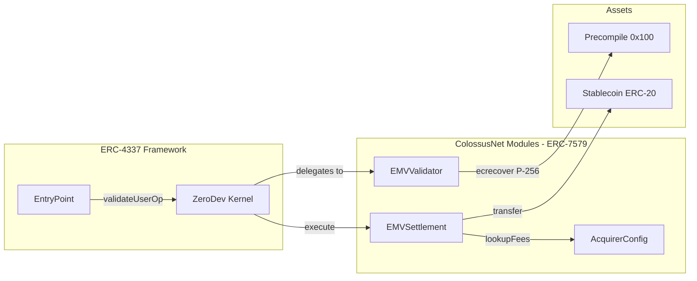

# Smart Contract Architecture

ColossusNet's on-chain logic is implemented as a set of modular smart contracts built on the ERC-4337 account abstraction standard with ERC-7579 modules.

## Contract Overview

The contract architecture is organized into three layers:



**Data flow summary:**

| Step | From | To | Call |
|------|------|----|------|
| 1 | EntryPoint | Kernel | `validateUserOp()` |
| 2 | Kernel | EMVValidator | delegates to (validation) |
| 3 | EMVValidator | Precompile `0x100` | `ecrecover_P256()` (RIP-7212) |
| 4 | Kernel | EMVSettlement | `execute()` |
| 5 | EMVSettlement | AcquirerConfig | `lookupFees()` |
| 6 | EMVSettlement | Stablecoin | `transfer()` |

---

## EMVValidator Contract

**Purpose:** Validates ECDSA P-256 signatures produced by ColossusNet cards.

### Storage Per Account

```solidity
struct EMVValidatorStorage {
    mapping(uint32 => bool) usedUnpredictableNumbers;
    bytes publicKey;  // 65-byte uncompressed P-256 public key
}
```

### Validation Flow

The validator executes the following seven steps on every `UserOperation`:

| Step | Action | Details |
|------|--------|---------|
| 1 | Extract EMV fields | Parse 63-byte EMV fields from nested `callData` |
| 2 | Validate target address | Target must equal `EMVSettlement` (immutable binding) |
| 3 | Validate function selector | Selector must be `execute` |
| 4 | Validate currency code | Currency code must be USD (`0x0840`) |
| 5 | Replay protection | Check `usedUnpredictableNumbers[UN]` is `false`, then mark as used |
| 6 | Signature verification | Compute `H = SHA-256(emvFields[0:61])`, call RIP-7212 precompile (`0x100`): `ecrecover_P256(H, r, s)`, compare recovered key with stored `publicKey` |
| 7 | Return result | Return `VALIDATION_SUCCESS` or `VALIDATION_FAILED` |

Step 5 (replay protection) ensures that each Unpredictable Number generated by the terminal can only be used once. Step 6 uses the RIP-7212 P-256 precompile at address `0x100` for native ECDSA verification on the secp256r1 curve.

---

## EMVSettlement Contract

**Purpose:** Executes token transfers with fee distribution after successful validation.

### Immutable Configuration

```solidity
address public immutable configuredToken;      // Stablecoin address
AcquirerConfig public immutable acquirerConfig; // Fee registry
uint8 public immutable decimals;               // Token decimals
```

The settlement contract is deployed per-acquirer with a fixed stablecoin address and fee registry reference. These values cannot change after deployment.

### Execution Flow

| Step | Action | Details |
|------|--------|---------|
| 1 | Extract BCD amount | Read BCD-encoded amount from EMV fields (offset 14, 6 bytes) |
| 2 | Convert BCD to integer | Each nibble 0-9, result in cents |
| 3 | Scale to token decimals | `amount * 10^(tokenDecimals - 2)` |
| 4 | Query fee breakdown | Call `AcquirerConfig.calculatePaymentDistribution()` |
| 5 | Execute ERC-20 transfers | Transfer fees to respective recipients, remainder to merchant |

---

## AcquirerConfig Contract

The `AcquirerConfig` contract is a registry that stores acquirer-specific configuration including fee rates, merchant mappings, and terminal registrations.

### Four-Tier Fee Structure

| Fee Type | Max Rate | Scope | Controlled By |
|----------|----------|-------|---------------|
| Acquirer Fee | 0.30% (30 bp) | Per-acquirer | Acquirer |
| Swipe Fee | Fixed amount | Per-acquirer | Acquirer |
| Interchange Fee | 2.50% (250 bp) | Global | Network Owner |
| Network Fee | 0.15% (15 bp) | Global | Network Owner |

Fees are deducted from the transaction amount before the merchant receives the remainder. The acquirer controls their own fee and swipe fee; the network owner sets the interchange and network fees globally.

> **Note:** The interchange fee only applies in the [issuer-mediated model](/overview#issuer-mediated) where an issuer posts collateral and funds transactions. In the [direct debit model](/overview#direct-debit) (no issuer), only the network fee, acquirer fee, and swipe fee are charged.

### Key Mappings

Each acquirer ID maps to an `AcquirerData` struct:

```
uint48 acquirerId => AcquirerData
  ├── address acquirerFeeRecipient
  ├── uint256 acquirerFeeRate          (basis points)
  ├── uint256 swipeFee                 (fixed)
  ├── mapping(uint120 => address) merchants   (merchantId => address)
  └── mapping(uint64 => address) terminals    (terminalId => address)
```

- **acquirerFeeRecipient**:the address that receives the acquirer's portion of fees
- **acquirerFeeRate**:the acquirer fee expressed in basis points (max 30 bp)
- **swipeFee**:a fixed per-transaction fee charged by the acquirer
- **merchants**:maps merchant IDs to their on-chain settlement addresses
- **terminals**:maps terminal IDs to their registered addresses for validation

---

## Currency-to-Token Mapping

The terminal uses standard EMV currency codes and exponent values with no terminal-side changes required. The `EMVSettlement` contract automatically converts the BCD-encoded amount to the corresponding ERC-20 token using the transaction's currency code (tag `5F2A`, ISO 4217).

### Supported Stablecoins

| Currency Code | ISO 4217 | Token |
|---------------|----------|-------|
| `0840` | USD | frxUSD (preferred) |
| `0840` | USD | USDC |
| `0840` | USD | USDT |
| `0840` | USD | USDG |
| `0840` | USD | USAT |

The `EMVSettlement` contract is configured at deployment with a single stablecoin address. Token selection is an acquirer-level configuration:each acquirer deployment specifies which supported stablecoin to use for settlement.

### BCD Conversion Formula

Amount conversion follows EMV's 12-digit BCD format with an implicit 2-decimal exponent:

```
tokenAmount = bcdToInt(amount_6bytes) * 10^(tokenDecimals - 2)
```

**Example:** A $25.50 transaction with USDC (6 decimals):

```
BCD input:    000000002550
bcdToInt:     2550          (cents)
tokenAmount:  2550 * 10^(6 - 2) = 25500000
```

## Source code

| Contract | Repository |
|----------|-----------|
| EMVValidator, EMVSettlement | [emv-validator](https://github.com/colossus-credit/emv-validator) |
| ZeroDev Kernel (ERC-4337 account) | [kernel](https://github.com/colossus-credit/kernel) |
