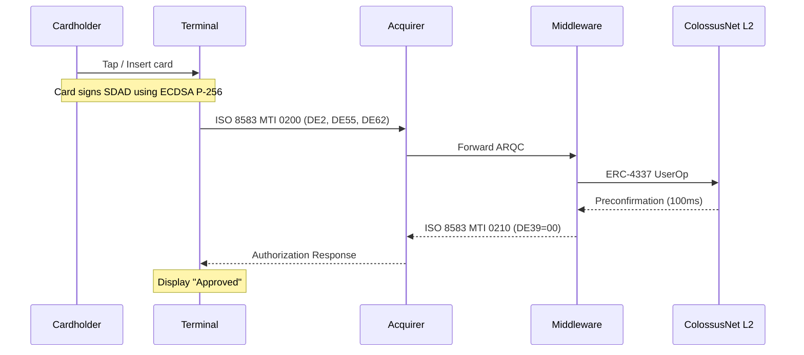
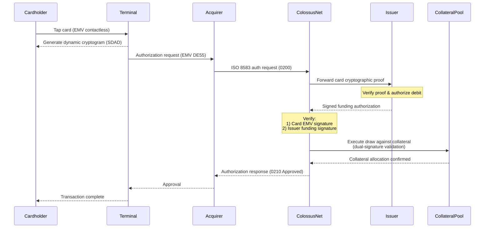

# Transaction Flow

ColossusNet supports two settlement paths and three kernel types. This page covers the end-to-end transaction flow for each combination, from card tap to on-chain settlement.

## Settlement Paths

ColossusNet supports two transaction settlement paths:

1. **Direct debit**: The cardholder's ERC-4337 account holds stablecoins on the ColossusNet L2. Transactions debit directly from this balance.
2. **Issuer-mediated**: A registered issuer posts collateral to ColossusNet and funds transactions on behalf of cardholders.

## Direct Debit Transaction Flow

In the direct debit model, the card signs the transaction data using ECDSA P-256, the acquirer forwards the ISO 8583 message to the middleware, the middleware constructs a UserOperation, and the sequencer preconfirms settlement from the cardholder's on-chain balance.

**Step-by-step:**

1. The cardholder taps or inserts their card at the terminal.
2. The card's secure element signs the transaction data (DDOL fields) with its P-256 private key, producing an ECDSA signature placed in the SDAD field (tag `9F4B`).
3. The terminal constructs an ISO 8583 MTI 0200 message containing the EMV data (DE55) and signature (DE62).
4. The acquirer forwards the authorization request to the ColossusNet middleware.
5. The middleware parses the ISO 8583 message, looks up the cardholder's ERC-4337 account by PAN, and constructs a UserOperation.
6. The sequencer executes the UserOp: the EMVValidator verifies the P-256 signature on-chain via the RIP-7212 precompile, and the EMVSettlement module transfers stablecoins from the cardholder's account to the merchant (minus fees).
7. The sequencer returns a preconfirmation within 100ms.
8. The middleware translates the result into an ISO 8583 MTI 0210 response and returns it to the acquirer.
9. The acquirer forwards the authorization response to the terminal.

## Issuer-Mediated Transaction Flow

In the issuer-mediated model, a registered issuer posts stablecoin collateral to a ColossusNet collateral pool. When a card transaction is received, ColossusNet forwards the card's cryptographic proof to the issuer. The issuer validates funds availability and returns a signed funding authorization. Using two signatures (the card's EMV signature and the issuer's funding signature), ColossusNet draws from the issuer's collateral pool to settle with the merchant.

**Key details:**

- The issuer must host a WebSocket signing endpoint at `/api/v1/eth_signRawTransactionSync`. The synchronous WebSocket design ensures issuer authorization fits within ColossusNet's 172ms authorization latency.
- The collateral pool balance is enforced on-chain. Transactions that would exceed available collateral are declined.
- Issuers register a **hook contract** on ColossusNet that executes within the transaction context. The hook validates that `txn.origin` matches the stored issuer address, ensuring only authorized issuers can draw against their collateral pool.
- After merchant settlement (instant, from collateral), the issuer independently retrieves the settlement amount from the cardholder on the source chain. The cardholder's source chain account should have ColossusNet ERC-7579 modules installed, enabling the issuer to noncustodially retrieve stablecoins.

### Issuer Settlement

After the merchant is settled from the issuer's collateral pool, the issuer independently retrieves the settlement amount from the cardholder on the source chain. See [Cross-Chain Architecture](/technical/cross-chain#how-issuer-settlement-works-across-chains) for the full cross-chain settlement flow.
